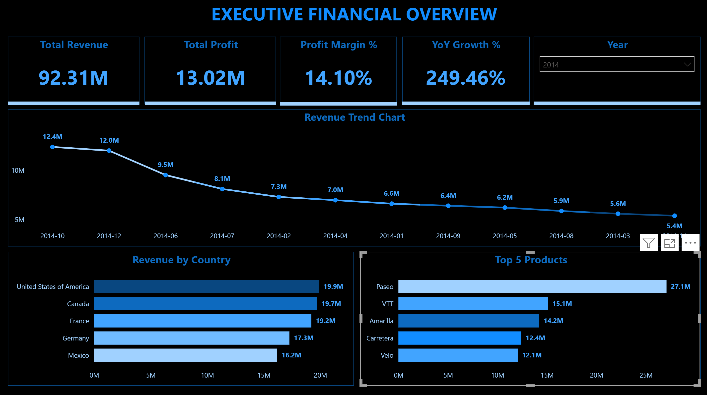
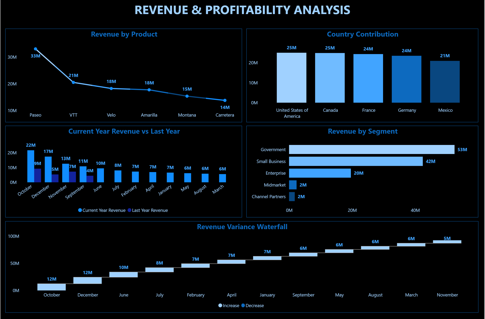
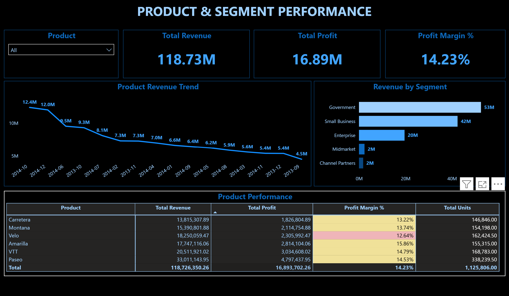

Financial Performance Dashboard (Power BI)

Project Overview

This project analyses financial performance across multiple countries, products, and segments using an interactive Power BI dashboard.

The objective is to identify revenue trends, evaluate profitability, and understand key business drivers.

Dataset

* Source: Public financial dataset
* Includes sales, profit, cost, and discount data
* Covers multiple countries, products, and segments

Tools Used

* Power BI (DAX, Data Modelling)
* Power Query (ETL)

Data Model

A star schema model was implemented:

* Fact table: Sales transactions
* Dimension tables: Date, Product, Segment, Country

Key KPIs

* Total Revenue
* Total Profit
* Profit Margin (%)
* Year-over-Year Growth

Key Insights

* Revenue increased significantly in 2014 compared to 2013 (~249%), influenced by higher transaction volume
* Government segment contributes the highest share of total revenue
* Certain products generate high sales but lower profit margins
* Discounts have a noticeable impact on profitability

Dashboard Preview

Executive Financial Overview

Revenue & Profitability Analysis

Product & Segment Performance

Features

* Interactive filters (Country, Segment, Product, Date)
* Time-based analysis (YoY growth)
* Drill-down capabilities
* Profitability breakdown across dimensions

Notes

Year-over-Year growth should be interpreted carefully due to uneven data distribution across years.
